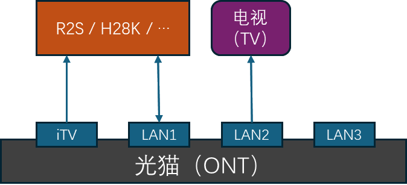

# MyIPTV

[中文](./README.zh-CN.md)

MyIPTV is a utility program that converts IPTV program streams from UDP
multicast to HTTP, and you can regard it as an enhanced (with admin UI)
[udpxy](https://github.com/pcherenkov/udpxy).

## HARDWARE

To use `MyIPTV`, the TV needs to support third-party apps.

A soft routing device is required, a 30$ - 40$ one such as `R2S` or `H28K`
is enough (I myself is using a R2S Plus, but seems H28K is a little cooler),
it's also okay to use a computer. The device should have at least two
network interfaces, and one of them must be a cable interface.

## NETWORK

My network structure is as below. The soft router device and the `iTV` port of
the ONT must be connected with a cable. For other connections, both cable and
WIFI are fine, but cable is recommended.



A static IP address should be bind to the LAN port of the soft routing device,
As an example, the static IP address which I am using is `192.168.1.2`.

## SOFTWARE

It is recommended to install a general operating system such as Ubuntu on the
soft router, not a dedicated soft routing system such as openwrt, I tried
FriendlyWrt at the beginning and failed.

Download a MyIPTV binary corresponding to the CPU architecture of the soft
router device from [here](https://github.com/localvar/myiptv/releases), and
then start `MyIPTV` by executing the commands like below:

```shell
$ mv myiptv-v0.1.0-linux.arm64 myiptv
$ chmod +x myiptv
$ ./myiptv
```

If your LAN IP address starts with `192.168.`, `MyIPTV` generally can correctly
detect the network-related configurations; If not, you need to manually prepare
a `myiptv.json` configuration file and restart MyIPTV. The configuration file
needs to contain at least the following settings:

```json
{
	"config": {
		"serverAddr": "192.168.1.2:7709",
		"mastIface": "eth0"
	}
}
```

Where `serverAddr` is the service address of `MyIPTV`, `mcastIface` is the name
of the network interface connected to the `iTV` port of the ONT.

After `MyIPTV` starts successfully, we can access its service via a browser.
Navigate to "http://{serverAddr}" (e.g. `http://192.168.1.2:7709`) then we can
see the admin UI. If you haven't configure `serverAddr` manually, its default
value is "{LAN IP of the soft router}:7709", e.g. `192.168.1.2:7709`.

> **Note**: The `MyIPTV` process will be killed at the close of the SSH session
> close, to keep it running, you may need `nohup` or make `MyIPTV` a daemon.

## IMPORT & EXPORT CHANNELS

We can import/export the channel list from the "Channel Management" page of the
admin UI. The imported/exported file is in CSV format, lines start with `#` are
comments, below is an example file:

```
#Group,Name,DisplayName,Hide,Logo,Source
CCTV,CCTV1,CCTV-1 综合,F,http://epg.51zmt.top:8000/tb1/CCTV/CCTV1.png,225.1.0.103:1025
CCTV,CCTV1,CCTV-1 综合,F,http://epg.51zmt.top:8000/tb1/CCTV/CCTV1.png,225.1.8.103:8002
CCTV,CCTV2,CCTV-2 财经,F,http://epg.51zmt.top:8000/tb1/CCTV/CCTV2.png,225.1.0.104:1025
CCTV,CCTV2,CCTV-2 财经,F,http://epg.51zmt.top:8000/tb1/CCTV/CCTV2.png,225.1.8.2:8084
Beijing,北京卫视,,F,http://epg.51zmt.top:8000/tb1/ws/beijing.png,225.1.0.111:1025
Beijing,北京卫视,,F,http://epg.51zmt.top:8000/tb1/ws/beijing.png,225.1.8.21:8002
```

## WATCH TV

`MyIPTV` can provide channel list in two format, `TEXT` and `M3U8`.

If the IPTV app on the TV side requires `TEXT` format (such as DIYP), the URL of the channel
list is `http://{serverAddr}/iptv/channels`, e.g. `http://192.168.1.2:7709/iptv/channels`.

If the IPTV app on the TV side requires `M3U8` format (such as Kodi), the URL of the channel
list is `http://{serverAddr}/iptv/channels?fmt=m3u8`, e.g. `http://192.168.1.2:7709/iptv/channels?fmt=m3u8`.

Currently, the EPG is provide only in JSON format of DIYP, its URL is
`http://{serverAddr}/iptv/epg`, e.g. `http://192.168.1.2:7709/iptv/epg`.

## DDNS

If you have a public IP, a domain name resolved by Cloudflare, then you can
publish your `MyIPTV` service to the Internet. Please take below configuration
as a reference on how to do this:


```json
{
	"ddns": {
		// The target domain record.
		"recordName": "myiptv.example.com",
		// Cloudflare zone ID
		"zoneID": "xxxxxxxxxxxxxxxxxxxxxxxx",
		// Cloudflare API key
		"apiKey": "yyyyyyyyyyyyyyyyyyyyyyyy",
		// URLs to fetch the public IP, if they return an IPv4 address, the A
		// record is updated, and AAAA record is updated if they return an IPv6
		// address.
		"wanIPProviders": ["http://ipv4.icanhazip.com", "https://whatismyip.akamai.com"],
		// DNS server addresses to speed up the DNS resolve process, this
		// configuration is optional, if provided, the address must include the
		// port number (typically 53). At most of the time, these should point
		// to the Cloudflare DNS servers of your domain.
		"dnsServers": ["beth.ns.cloudflare.com:53", "rudy.ns.cloudflare.com:53"]
	}
}
```

## DEVELOPMENT

The frontend of `MyIPTV` is developed with `Vue` and `Ant Design Vue`, I'm not
good at frontend, that's only basic features have been implemented. 

The backend is developed with `Go`, without any third party dependencies, and
will not add one in the future.

The UDP packet parsing feature is copied from `udpxy`, thanks Pavel Cherenkov,
the author of `udpxy`.

Maybe I will implement the following features later, but there's not any
guarantee.

- Channel list support more formats.
- EPG support more formats.
- Install MyIPTV as a daemon.
- Scan for IPTV sources.
- Admin UI support other languages.

And, welcome PRs.
